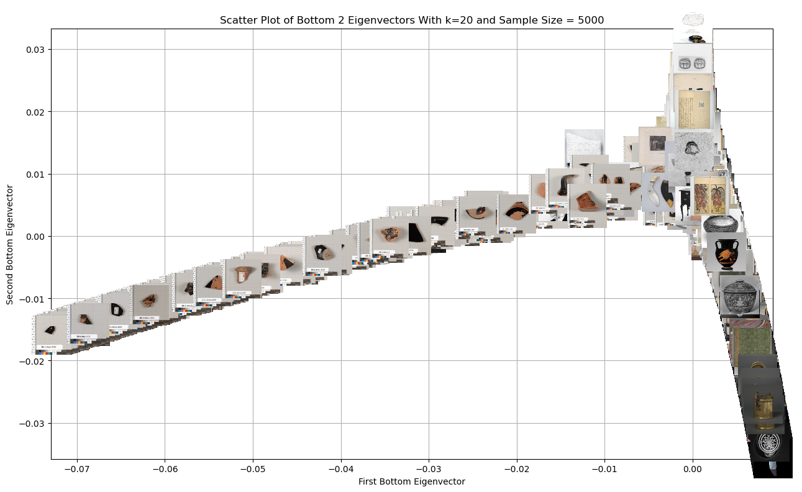
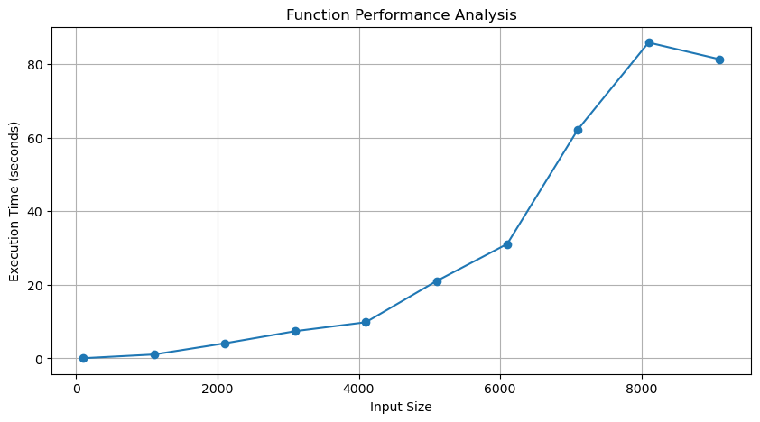

https://kevinbian107.github.io/laplacian_eigenmap_vis/

# Toy Example
## 2 Bottom Eigenvector With Non-zero Eigenvalue + Images

    

## 3 Bottom Eigenvector With Non-zero Eigenvalue

    

# MET Example
## 2 Bottom Eigenvector With Non-zero Eigenvalue + Images

    

## 3 Bottom Eigenvector With Non-zero Eigenvalue

    

# Eigenmap Function Performances

    

