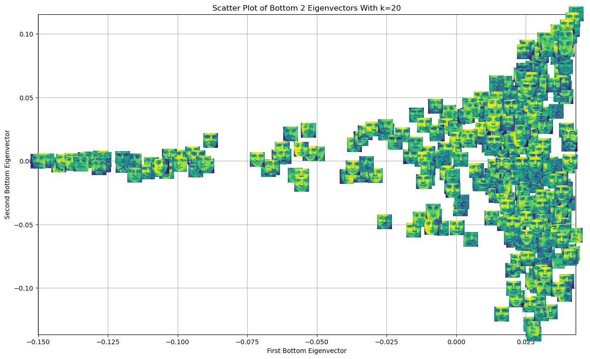
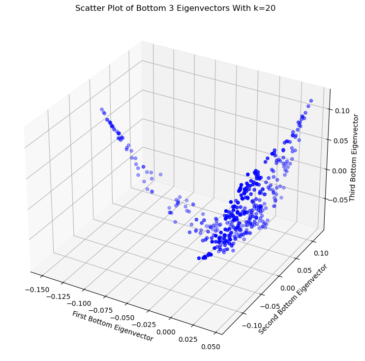
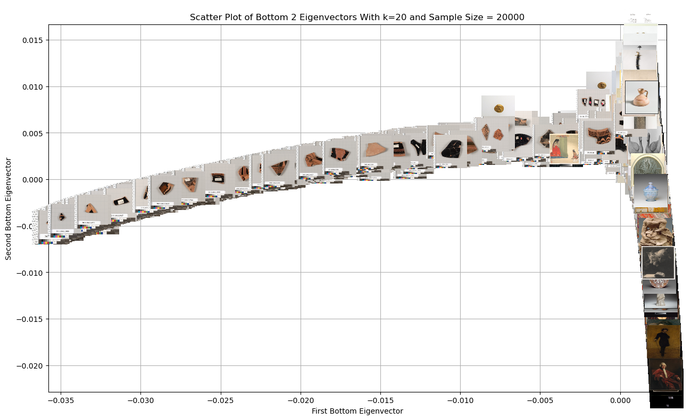
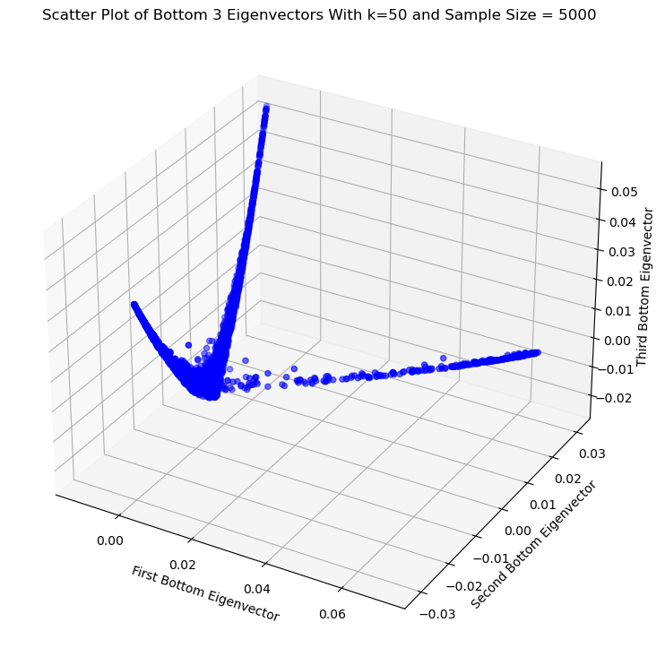
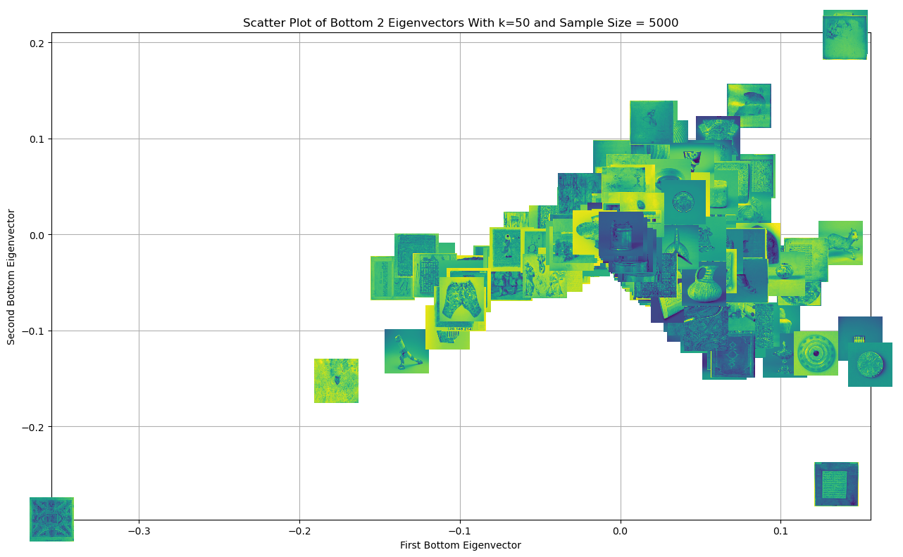
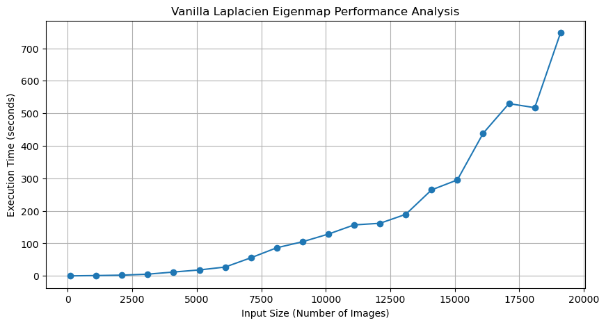

https://kevinbian107.github.io/laplacian_eigenmap_vis/

# Toy Example (KNN Similarity Matrix)
## Top 2 Eigenvector PCA

    

## Bottom 3 Eigenvector With Non-zero Eigenvalue Laplacien Eigenmap

    

# MET Example (KNN Similarity Matrix)
## Bottom 2 Eigenvector With Non-zero Eigenvalue + Images

    

## Bottom 2 Eigenvector With Non-zero Eigenvalue

    

# MET Example (Mutual KNN + Adaptive Gaussian Radial Kernel Similarity Matrix)
## Bottom 2 Eigenvector With Non-zero Eigenvalue + Images

    

# Eigenmap Function Performances (KNN Similarity Matrix)

    

